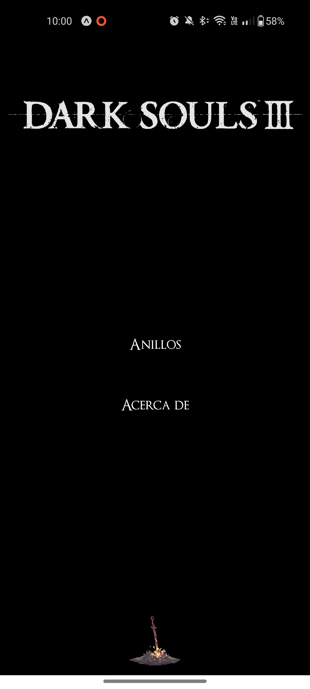

# Dark Seeker

Bienvenido Latente.

En un mundo donde la oscuridad y la desolación reinan, tú, un caballero errante en busca de la verdad, has tomado la antorcha para iluminar los rincones más sombríos del Reino de Lothric. Esta aplicación es tu fiel guía, diseñada para asistirte en tu arduo camino hacia la grandeza y la gloria.

Aquí encontrarás los secretos mejor guardados, aquellos objetos ocultos en las sombras y las proezas necesarias para reclamar todos los logros que Lothric puede ofrecer. Desde anillos de poder hasta gestos y hechizos olvidados, nuestro compendio te acompañará, asegurándote que nada quede sin descubrir.

Adéntrate en este viaje, y que las llamas de tu determinación nunca se extingan.


## Screenshots




## Installation

Clona el repositorio:

```bash
  git clone https://github.com/NelmerStgo/DS-Rings.git
```

## Instala las dependencias

```bash
  npm install
```    

## Instala las dependencias

```bash
  npx expo start
```    

Si en esta parte te marca error, actualiza el Expo CLI:

```bash
  npm install -g expo-cli
``` 

## Tecnologías utilizadas

* React Native

* Expo

* GitHub

* VS Code


## License

[MIT](https://choosealicense.com/licenses/mit/)


## Authors

- [@NelmerStgo](https://github.com/NelmerStgo)

